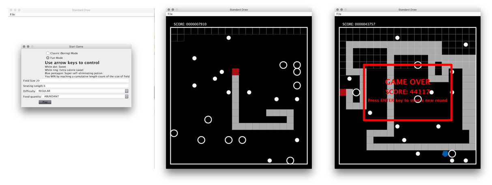

# SnakeGame

- An extra credit assignment in my Java course.
- Everthing is packed in one file because the assignment only accepts one file.
- Code is almost unreadable in order to conform to required code style check (irony).

[The StdDraw Library](http://introcs.cs.princeton.edu/java/stdlib/) (GPLv3). Basically a wrapper of java.awt.Graphics2D.
